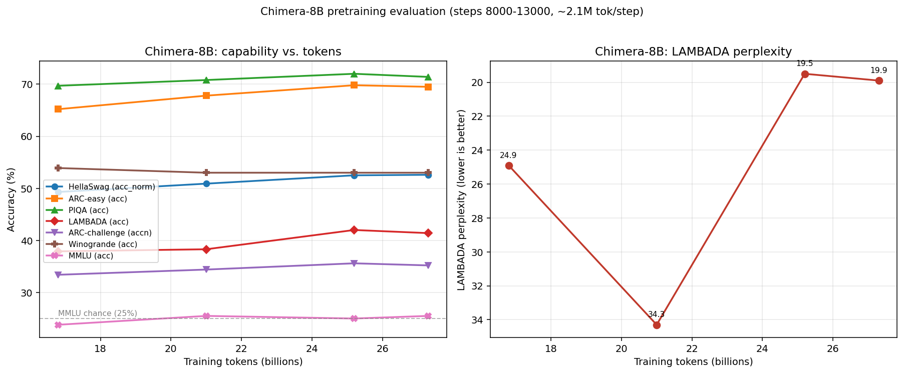

# Chimera-8B Pretraining Technical Report

## 1. Summary

We pretrained **Chimera-8B**, a 7.6-billion-parameter dense decoder-only language
model, from scratch on 27B tokens of high-quality educational web text
(FineWeb-Edu). Training used **FSDP2** with bf16 mixed precision across 32 AMD
MI300X GPUs (4 nodes × 8), completing 13,000 optimizer steps in roughly 27 hours
of wall-clock time.

The final model shows healthy language-modeling and commonsense-reasoning ability
for its token budget: **HellaSwag 52.6% (acc_norm), ARC-easy 69.5%, PIQA 71.4%,
LAMBADA acc 41.4% / ppl 19.9**. Knowledge-heavy MMLU remains at chance (~25.5%),
as expected for this scale and data regime, and coding ability is zero (HumanEval
pass@1 = 0%) because the training corpus contains essentially no code.

This report documents the architecture, data, infrastructure, training
configuration, a numerical-stability incident and its fix, and the full
evaluation results.

---

## 2. Model Architecture

Chimera is a Qwen3-style dense transformer. Design choices follow modern
open-weight dense LLMs:

| Component | Choice |
|---|---|
| Layers | 32 |
| Hidden dim | 4096 |
| Attention | GQA, 32 query heads / 8 KV heads |
| Head dim | 128 |
| FFN | SwiGLU, intermediate 14336 |
| Norm | RMSNorm, pre-norm |
| Positional | RoPE (NeoX split-half convention) |
| **QK-Norm** | RMSNorm on per-head Q and K (on) |
| Bias | none (all linears bias-free) |
| Embeddings | tied input/output |
| Vocab | 151,936 (Qwen3 tokenizer, padded) |
| Sequence length | 4096 |
| Parameters | **7.602 B** |

**Key architectural detail — depth-scaled residual initialization.**
Output projections that write into the residual stream (attention `wo`, FFN `w2`)
are initialized with `std = 0.02 / sqrt(2 · n_layers)` rather than a flat 0.02.
Without this scaling, residual variance compounds across 32 layers and the model
is prone to divergence early in training (see §7). All other linears use
`std = 0.02`.

The architecture is deliberately convention-compatible with HuggingFace
`Qwen3ForCausalLM`, which lets us export checkpoints losslessly for fast
inference and evaluation (§9).

---

## 3. Data

- **Corpus:** `HuggingFaceFW/fineweb-edu`, `sample-100BT` config — FineWeb web
  text filtered by an educational-quality classifier. Predominantly English
  prose; **near-zero code**.
- **Tokenizer:** Qwen3 (vocab 151,936; EOT/`<|endoftext|>` = 151,643).
- **Tokenized size:** **99.66 B tokens**, stored as a flat `uint32` memmap
  (`train.bin` ≈ 398 GB) plus a validation shard.
- **Tokenization pipeline:** streaming HF dataset → 96-process parallel tokenize →
  preallocated memmap write. Documents are joined with the EOT token as the
  document separator.

**Consumption this run:** ~2.1 M tokens/step × 13,000 steps ≈ **27 B tokens**,
i.e. about 0.27 epochs over the 100BT corpus (well under one full pass).

The lack of code in the corpus is an intentional characteristic of the FineWeb-Edu
recipe and directly explains the 0% coding score in §10.

---

## 4. Infrastructure

| Item | Detail |
|---|---|
| Accelerators | 4 nodes × 8 AMD MI300X (192 GB HBM3 each) = 32 GPUs |
| Interconnect | 8× InfiniBand per node, real RDMA (RCCL verified cross-node) |
| SKU | Singularity `ND96isr_MI300X_v5`, eastus2 |
| Software | PyTorch 2.8 (ROCm 6.4.3 custom build), conda `py_3.10` |
| Storage — code | node-local `/scratch/code` (git-synced) |
| Storage — data/ckpt | shared blobfuse2 mount |

Storage is deliberately layered: code lives on fast node-local disk (git pull per
node), while the multi-hundred-GB dataset and checkpoints live on the shared
blob-backed mount readable by all nodes.

---

## 5. Training Configuration

**Parallelism & precision.** FSDP2 (`fully_shard`) with a mixed-precision policy
of `param_dtype = bfloat16`, `reduce_dtype = float32`. Gradient all-reduce is
accumulated in fp32 for cross-node numerical stability; optimizer master weights
are fp32. **bf16 (not fp16)** was chosen for its fp32-equivalent dynamic range,
which removes the need for loss scaling / GradScaler entirely.

| Hyperparameter | Value |
|---|---|
| Optimizer | AdamW |
| Peak LR | **2e-4** |
| LR schedule | cosine decay to 2e-5 |
| Warmup | **500 steps** |
| Sequence length | 4096 |
| Micro-batch / GPU | 2 |
| Gradient accumulation | 8 |
| Global batch | 32 GPU × 2 × 8 = 512 seqs ≈ **2.1 M tokens/step** |
| Max steps | 13,000 |
| Gradient clipping | yes + non-finite grad skip (§7) |

**Micro-batch tuning.** At seq 4096, micro_bsz = 2 peaks at ~89–97 GB/GPU (the
sweet spot). micro_bsz = 4 peaks at 180.7 GB / 192 GB (94%, unsafe) *and* lowered
throughput, so 2 was locked in.

Sustained throughput was **~189 K tokens/s** at ~89 GB/GPU memory.

---

## 6. Training Dynamics

Loss fell from ~12.7 at initialization to **~2.3–2.4** at step 13,000, with
gradient norm stable in the 0.037–0.06 range through the cosine tail. Validation
loss tracked training loss (val_loss ≈ 3.33 at step 1000, improving thereafter).

The non-finite-gradient guard (§7) skipped **455 optimizer steps** out of 13,000
(~3.5%) — isolated gradient spikes that were dropped without harming the run.

Checkpoints were written every 2,000 steps (~93 GB each) in `.pt` format for
resume, plus a final `ckpt_13000.pt`.

---

## 7. Numerical Stability: NaN Incident & Fix

**Incident.** An earlier attempt of this run went to NaN at **step 110**
(lr ≈ 1.66e-4, still in warmup). Steps 0–100 were healthy (loss 12.73 → 6.30).
No checkpoint existed yet (ckpt_every = 2000), so the run was restarted.

**Root cause.** Residual output projections (`wo`, `w2`) were initialized without
depth scaling. Over 32 layers, residual-stream variance compounded until an
activation/gradient spike during warmup pushed the model past the point of
recovery.

**Fix — three co-equal changes (all required):**

1. **Depth-scaled residual init** (root cause): `std = 0.02 / sqrt(2·n_layers)`
   on residual-writing projections.
2. **Non-finite gradient skip** (decisive runtime defense): if `grad_norm` is not
   finite, skip the optimizer step and zero grads instead. Gradient *clipping*
   only tames `inf` (via `1/inf = 0`); it does **not** stop a "finite-but-huge"
   gradient from permanently poisoning the weights. This guard does.
3. **Conservative LR/warmup** (spike-frequency reduction): peak LR 3e-4 → 2e-4,
   warmup 200 → 500.

With all three in place the restarted run trained cleanly to completion with zero
true NaNs. A standalone postmortem is kept in `docs/incident_8b_loss_nan.md`.

---

## 8. Checkpointing

- Format: PyTorch `.pt` pickle (model + optimizer + step) for exact resume.
- Cadence: every 2,000 steps; ~93 GB per checkpoint on shared storage.
- For inference/eval, checkpoints are additionally exported to HuggingFace
  safetensors format (§9).

---

## 9. Checkpoint Export & Fast Evaluation Path

**export_hf.py — Chimera `.pt` → HF Qwen3 safetensors.**
Because Chimera is convention-compatible with Qwen3, export is a pure weight
remap (no permutation needed — the RoPE convention is identical split-half NeoX;
QK-Norm, bias-free, tied-embeddings all match):

`tok_emb→embed_tokens`, `attn_norm→input_layernorm`,
`attn.wq/wk/wv/wo→self_attn.{q,k,v,o}_proj`,
`attn.q_norm/k_norm→self_attn.{q,k}_norm`,
`ffn_norm→post_attention_layernorm`, `ffn.w1/w3/w2→mlp.{gate,up,down}_proj`,
`norm→model.norm`, tied `lm_head`.

**Parity verification:** exported HF model vs native Chimera forward pass —
**argmax agreement 100.00%**, `max|Δ| = 3.45e-2`, `mean|Δ| = 4.38e-3` (bf16 noise
level). The export is numerically equivalent.

**Evaluation backend.** Multiple-choice tasks are scored via log-likelihood in a
native lm-eval wrapper. For generative/coding tasks we use
`lm_eval --model hf` on the exported model, which gives transformers' native
**KV-cache** generation — about **50× faster** than a naive no-cache loop
(HumanEval 164 items in 11 min vs ~9.7 h).

*Note on vLLM:* vLLM on MI300X was evaluated and rejected for this environment.
PyPI vLLM wheels are CUDA-only (missing ROCm kernels) and would clobber the custom
ROCm torch; the ROCm source build is a 30–60 min, ABI-fragile effort not justified
for a baseline. transformers + KV-cache was sufficient.

---

## 10. Results

Multiple-choice / language-modeling evaluation (lm-eval-harness, zero-shot) across
checkpoints. This gives a capability-vs-tokens curve (each +2000 steps ≈ +4.2 B
tokens):

| Task (metric) | 8000 | 10000 | 12000 | **13000 (final)** |
|---|---|---|---|---|
| HellaSwag (acc_norm) | 49.3 | 50.9 | 52.5 | **52.6** |
| LAMBADA (acc) | 37.9 | 38.3 | 42.0 | **41.4** |
| LAMBADA (ppl ↓) | 24.9 | 34.3 | 19.5 | **19.9** |
| ARC-easy (acc) | 65.2 | 67.8 | 69.8 | **69.5** |
| ARC-challenge (acc_norm) | 33.4 | 34.4 | 35.6 | **35.2** |
| PIQA (acc) | 69.7 | 70.8 | 72.0 | **71.4** |
| Winogrande (acc) | 53.9 | 53.0 | 53.0 | **53.0** |
| MMLU (acc) | 23.8 | 25.5 | 25.0 | **25.5** |

(values in %)

*Left: accuracy metrics vs. training tokens (dashed line = MMLU 25% chance).
Right: LAMBADA perplexity (y-axis inverted, higher-on-plot is better).*

**Coding (final):** HumanEval pass@1 = **0.0%**.

**Observations.**
- Commonsense/language-modeling metrics rose steadily through training and had not
  fully plateaued at 13,000 steps — HellaSwag, ARC-easy, PIQA and LAMBADA all
  improved materially from step 8000 (e.g. HellaSwag +3.3, LAMBADA ppl 24.9 → 19.9).
- The 10000-step LAMBADA ppl (34.3) is an outlier against an otherwise monotone
  trend, likely a checkpoint-local fluctuation; acc at the same step is on-trend.
- **Winogrande (~53%)** stayed flat — coreference needs more world knowledge/scale
  than 27 B tokens at 8 B params provides.
- **MMLU (~25%)** is at random (4-way chance); knowledge-heavy multiple choice is
  not activated at this scale/data budget.
- **Coding 0%** is expected and correct: FineWeb-Edu contains essentially no code.

---

## 11. Lessons Learned

1. **Depth-scaled residual init is not optional** for deep (32-layer) dense models;
   omitting it invites early-warmup divergence.
2. **A non-finite-gradient skip guard is the decisive NaN defense** — gradient
   clipping alone does not protect against finite-but-huge poison gradients.
3. **Prefer bf16 over fp16** for large-model pretraining: fp32-equivalent dynamic
   range, no loss scaling.
4. **micro-batch sizing is a throughput *and* safety decision** — the largest batch
   that fits is not always fastest, and can be dangerously close to OOM.
5. **Architecture-compatibility with a mainstream HF class (Qwen3) pays off** —
   lossless export unlocks fast eval and future serving with zero extra glue.
6. **vLLM on MI300X is not a drop-in** in a custom-ROCm container; transformers +
   KV-cache is a pragmatic fast-eval fallback.

---

## 12. Appendix — Key Facts

- **Model:** Chimera-8B, 7.602 B params, dim 4096 / 32 L / 32Q-8KV / SwiGLU 14336 /
  seq 4096, Qwen3 tokenizer.
- **Data:** FineWeb-Edu sample-100BT, 99.66 B tokens; ~27 B consumed (0.27 epoch).
- **Compute:** 32× MI300X, FSDP2, bf16; ~189 K tok/s; 13,000 steps.
- **Optimizer:** AdamW, LR 2e-4 cosine→2e-5, warmup 500, global batch ~2.1 M tok.
- **Final loss:** ~2.3–2.4. Skipped steps (non-finite grad): 455 / 13,000.
- **Checkpoints:** every 2000 steps, `.pt`, ~93 GB; final `ckpt_13000.pt` + HF export.
- **Related docs:** `docs/incident_8b_loss_nan.md` (NaN postmortem).
